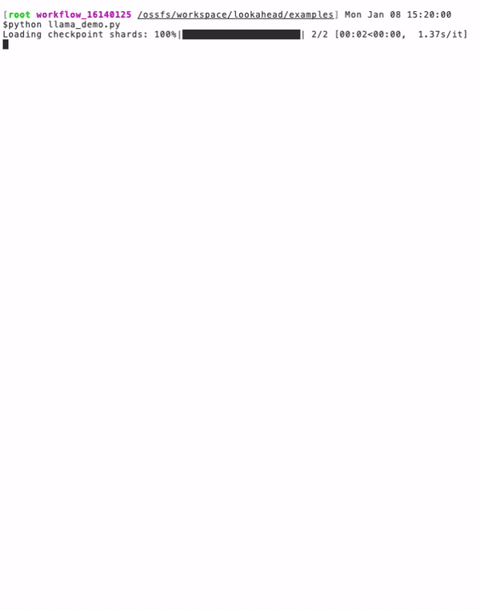
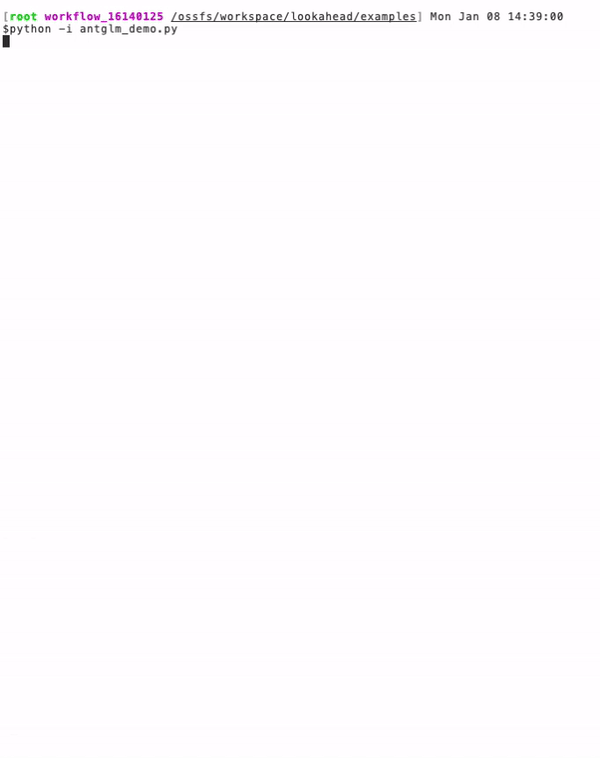
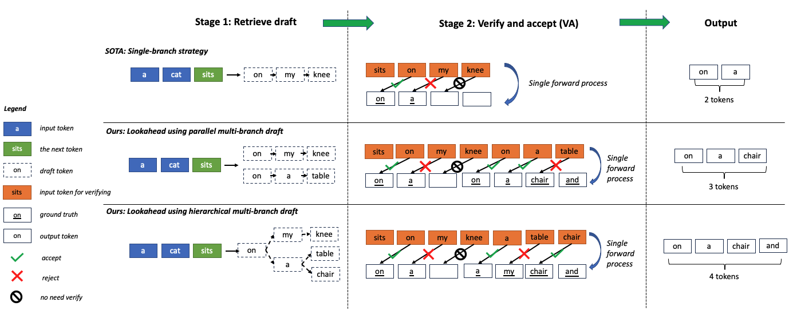

<h1 align="center">Painless Inference Acceleration (PIA)</h1>


  
<p align="center">
   A toolkit for LLM inference without 😭 . Currently it contains our work LOOKAHEAD, a framework which accelerates LLM inference without loss of accuracy, other works will release soon.
</p>

<!-- [[Paper](https://arxiv.org/abs/2312.12728)] -->


## *News or Update* 🔥

- [2024/01] We support all models of baichuan family (Baichuan-7b & 13b, Baichuan2-7b & 13b).

- [2024/01] We fully support repetition_penalty.

- [2024/01] We support Mistral & Mixtral [example](https://github.com/alipay/PainlessInferenceAcceleration/blob/main/pia/lookahead/examples/mixtral_example.py).

- [2023/12] We released our [Lookahead paper](https://arxiv.org/abs/2312.12728) on arXiv!

- [2023/12] PIA released 💪 !!! Fast, Faster, Fastest 🐆 !!!


## Models we support 

- GLM
- Baichuan & Baichuan 2 
- BLOOM
- ChatGLM
- GPT-2
- GPT-J
- LLaMA & LLaMA-2
- Mistral
- Mixtral 
- OPT
- Qwen

## Known issuss & TODO

<del> ISSUE 1. repetition_penalty is not fully supported, we will fix it in the future.  </del>

ISSUE 2. lookahead may generate responses different from original ones due to low-precise data type (i.e., fp16 or bf16), the responses would be the same with fp32.

ISSUE 3. Baichuan tokenizer cannot be initialized with lastest transformers version (4.30.2 can work).

ISSUE 4. Qwen model may generate different responses with lookahead when repetition_penalty is set.

<del> TODO1: support the latest version  [🤗 transformers](https://github.com/huggingface/transformers) ]. Currently it's based on 4.30.2. </del>

TODO2: integrate our work [FastCoT](https://arxiv.org/pdf/2311.08263.pdf)

## Performance Comparison

Performance is measured by token/s(tokens per second) of generation tokens.

### Public datasets and models

We use the first 1000 samples for evaluation and the rest for trie-tree cache construction. The hyper-parameters are `decoding_length=64` and `branch_lenght=8`. The tag `fused` indicates operators are fused with triton, the implementation can be found in `modeling_llama_batch.py`.

| model                  | dataset       | GPU           | 🤗 transformers | lookahead    |
|------------------------|---------------|---------------|-----------------|--------------|
| Llama2-7b-chat         | Dolly-15k     | A100-80G      | 40.6            | 83.7 (x2.06)  |
| Llama2-7b-chat(fused)  | Dolly-15k     | A100-80G      | 50.4            | 106.8 (x2.12) |
| Llama2-13b-chat        | Dolly-15k     | A100-80G      | 34.0            | 71.7 (x2.11)  |
| Llama2-13b-chat(fused) | Dolly-15k     | A100-80G      | 39.9            | 84.6 (x2.12)  |
| ChatGLM2-6b            | Dolly-15k     | A100-80G      | 45.6            | 108.4 (x2.38) |
| Llama2-7b-chat         | GSM-8k        | A100-80G      | 41.4            | 111.3 (x2.69) |
| Llama2-7b-chat(fused)  | GSM-8k        | A100-80G      | 53.7            | 149.6 (x2.79) |
| Llama2-13b-chat        | GSM-8k        | A100-80G      | 31.2            | 71.1 (x2.28)  |
| Llama2-13b-chat(fused) | GSM-8k        | A100-80G      | 42.9            | 103.4 (x2.41) |
| ChatGLM2-6b            | GSM-8k        | A100-80G      | 43.3            | 94.0 (x2.17)  |


We test 5 examples with Llama2-7b-chat and dolly dataset, inference time without lookahead (the left figure) is 15.7s (48.2token/s), while inference time with lookahead is 6.4s (112.9token/s), speedup is 2.34.

[//]: # (![glm_without_lookahead]&#40;./pia/lookahead/figures/llama_la_off.gif&#41;![glm_with_lookahead]&#40;./pia/lookahead/figures/llama_la_on.gif&#41;)
[//]: # (<div align=center>)

[//]: # ()

[//]: # (</div>)
<div align=center>

</div>


### Private datasets and models

We use the first 1000 samples for evaluation and the rest for trie-tree cache construction. The hyper-parameters are `decoding_length=128` and `branch_lenght=32`.

Our method could obtain significant acceleration in RAG (Retrieval Augmented Generation) scenarios. However, there is no real-life datasets available currently. Therefore, we only evaluate on our private datasets and models. 
AntGLM-10B is a LLM developed by Ant Group with [GLM](https://huggingface.co/THUDM/glm-10b-chinese) architecture. 

| model          | scenarios       | GPU           | 🤗 transformers | Lookahead    |
|----------------|---------------|---------------|-----------------|--------------|
| AntGLM-10b     | Citizen Biz Agent     | A100-80G      | 52.4            | 280.9(x5.36) |
| AntGLM-10b     | Enterprise Info QA    | A100-80G      | 50.7            | 259.1(x5.11) |
| AntGLM-10b     | Health Suggestion     | A100-80G      | 51.6            | 240.2(x4.66) |


[//]: # (![llama_without_lookahead]&#40;./pia/lookahead/figures/glm_la_off.gif&#41;![llama_with_lookahead]&#40;./pia/lookahead/figures/glm_la_on.gif&#41;)

We test 5 examples with AntGLM-10B and AntRag dataset, inference time without lookahead (the left figure) is 16.9s (33.8token/s), while inference time with lookahead is 3.9s (147.6token/s), speedup is 4.37.

[//]: # (<div align=center>)

[//]: # ()

[//]: # (</div>)

<div align=center>

</div>

## Introduction

Our repo PIA (short for Painless Inference Acceleration) is used for LLM inference, it is based on [🤗 transformers](https://github.com/huggingface/transformers)  library.

- It uses an on-the-fly trie-tree cache to prepare hierarchical multi-branch drafts, without the demand for assist models (e.g., speculative decoding) or additional head training (e.g., block decoding). 
With the efficient hierarchical structure, we can lookahead tens fo branches, therefore significantly improve generated tokens in a forward pass.

- You can also benefit from our optimized fuesed operation kernels.

Note that our work is different from the other method named [lookahead decoding](https://github.com/hao-ai-lab/LookaheadDecoding). 


### Hierarchical multi-branch draft




[//]: # (![dynamic]&#40;./pia/lookahead/figures/dynamic.gif&#41;)


## Lincense （使用协议）

协议为CC BY 4.0 (https://creativecommons.org/licenses/by/4.0/)

使用本项目前，请先阅读LICENSE.txt。如果您不同意该使用协议中列出的条款、法律免责声明和许可，您将不得使用本项目中的这些内容。

## Installation

1. Clone this repository and navigate to PainlessInferenceAcceleration
```
git clone https://github.com/alipay/PainlessInferenceAcceleration.git
cd PainlessInferenceAcceleration
```
2. Install Package
```
python setup.py install
```

## Quick Start


Below is an example for the simplest use of `lookahead` to inference:

```python

import torch
from transformers import AutoTokenizer


from pia.lookahead.common.lookahead_cache import LookaheadCache
from pia.lookahead.models.llama.modeling_llama import LlamaForCausalLM

model_dir = 'meta-llama/Llama-2-7b-chat-hf'
model = LlamaForCausalLM.from_pretrained(model_dir
                                         , cache_dir='./'
                                         , torch_dtype=torch.float16
                                         , low_cpu_mem_usage=True
                                         , device_map='auto'
                                         )
tokenizer = AutoTokenizer.from_pretrained(model_dir)

prompt = "Hello, I'm am conscious and"
inputs = tokenizer(prompt, return_tensors="pt")

output_ids = model.generate(input_ids=inputs.input_ids.cuda(),
                            attention_mask=inputs.attention_mask.cuda(),
                            max_new_tokens=256,
                            decoding_kwargs={'use_lookahead': True}
                            )
response = tokenizer.decode(output_ids[0].tolist())
print(f'{response=}')
```

To use `lookahead` with other models, we can run the scripts in the path `examples/`.
Each supported models are included and  can be used for correctness evaluation.

```shell
python [model name]_example.py
```

To evaluation speedup of `lookahead`, we can run the scripts in the path `benchmarks/`,


## Customize Model

<details>

<summary>

To support a customize model, usually we only need add a few lines, here is a example for supporting Llama: </summary>

```python

from pia.lookahead.common.pretrained_model import LookaheadPreTrainedModel
class LlamaPreTrainedModel(LookaheadPreTrainedModel):
    '''
    other code
    '''

class LlamaModel(LlamaPreTrainedModel):

    '''
    other code
    '''

    def forward(
            self,
            input_ids: torch.LongTensor = None,
            attention_mask: Optional[torch.Tensor] = None,
            position_ids: Optional[torch.LongTensor] = None,
            past_key_values: Optional[List[torch.FloatTensor]] = None,
            inputs_embeds: Optional[torch.FloatTensor] = None,
            use_cache: Optional[bool] = None,
            output_attentions: Optional[bool] = None,
            output_hidden_states: Optional[bool] = None,
            return_dict: Optional[bool] = None,
    ) -> Union[Tuple, BaseModelOutputWithPast]:

        '''
        other code
        '''

        """
        NOTE: adapt for lookahead
        lookahead always use a rank-4 tensor for attention_mask, then a minimum adaption for lookahead is routed by the rank,
        Lookahead: generate position_ids from attention_masks and set zero elements of the mask to -inf 
        """
        if attention_mask is not None and len(attention_mask.shape) == 4:
            # with lookahead
            position_ids = torch.sum(attention_mask, dim=-1).squeeze(1) - 1
            attention_mask = (1.0-attention_mask.to(inputs_embeds.dtype)) * torch.finfo(inputs_embeds.dtype).min
        else:
            # without lookahead, reuse the original code lines
            if position_ids is None:
                device = input_ids.device if input_ids is not None else inputs_embeds.device
                position_ids = torch.arange(
                    past_key_values_length, seq_length + past_key_values_length, dtype=torch.long, device=device
                )
                position_ids = position_ids.unsqueeze(0).view(-1, seq_length)
            else:
                position_ids = position_ids.view(-1, seq_length).long()

            if attention_mask is None:
                attention_mask = torch.ones(
                    (batch_size, seq_length_with_past), dtype=torch.bool, device=inputs_embeds.device
                )
            attention_mask = self._prepare_decoder_attention_mask(
                attention_mask, (batch_size, seq_length), inputs_embeds, past_key_values_length
            )
```


Note that the above adaption can not be used for batch inference, as generated token length of different samples may be varied. Adaption for batch 
inference can be found in `models/modeling_glm_batch.py` or `models/modeling_llama_batch.py`. `Flash-attention` enhanced batch inference is on developing.

</details>


## Supported Models

We currently support a range of models, including Llama, OPT, Bloom, GPTJ, GPT2, Baichuan, ChatGLM, GLM, and Qwen. We welcome contributions to extend support to additional models. 

## Tests

Tests can be run with:
```shell
cd pia/lookahead
pytest tests/ -s
```


## Citations

@misc{zhao2023lookahead,
      title={Lookahead: An Inference Acceleration Framework for Large Language Model with Lossless Generation Accuracy}, 
      author={Yao Zhao and Zhitian Xie and Chenyi Zhuang and Jinjie Gu},
      year={2023},
      eprint={2312.12728},
      archivePrefix={arXiv},
      primaryClass={cs.IR}
}

