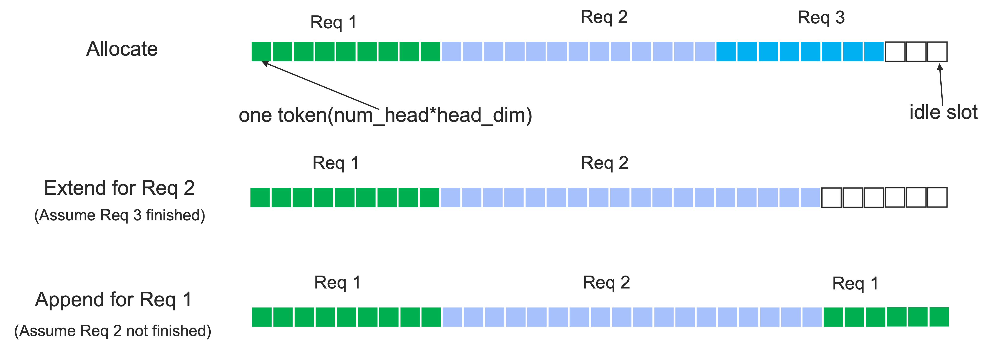

<h1 align="center">FLOOD</h1>


  
<p align="center">
   FLOOD, a throughput-oriented framework with pipeline parallism and segmentable cache.
</p>


## *News or Update* 🔥

- [2025/03] We release the code of our inference framework `FLOOD`.


## Introduction

Flood is a highly effective inference framework designed for offline applications. It employs a pipeline parallelism (PP) approach to minimize communication costs associated with tensor parallelism (TP). This framework incorporates advanced scheduling strategies tailored for offline inference processes to optimize GPU utilization to its fullest potential. 

Furthermore, Flood utilizes segmentable blocks instead of paged blocks for kvcache management, thereby enhancing the continuity of the kvcache for requests.

<div align=center>

</div>

[//]: # (<div align=center>)

[//]: # ()

[//]: # (</div>)

Additionally, we have developed an attention kernel, termed SegmentAttention, to function with the segmentable kvcache. Flood currently supports a range of features, including:
- Chunk prefill 
- Quantization techniques utilizing FP8 and INT8 formats
- Inference of multi-modal models
- Streaming inference
- PPL (Perplexity) evaluation
- Sampling methods
- Multi-node inference(experimental)

Our framework is undergoing rapid iteration, which may result in some features having bugs. If you encounter any issues, please feel free to report them.

## Models we support

- Ling MoE
- Ling
- Llama
- Qwen
- Deepseek v1

## Roadmap

- Integrate our previous work `LOOKAHEAD`. 

- Improve prefill performance with Prefix caching.

- Improve performance with CUDA-Graph.

- Support more models, include Deepseek R1, etc.

- Implement segment attention with `CUTE` for better performance, especially with FP8 kvcache.


## Performance Comparison


### Throughput

Performance is measured by token/s(tokens per second) of generated tokens. The version of vLLM is 0.6.6.post2, we enable the chunk prefill with chunk size 2048, other parameters are the same as default. The model archetechure of Ling can be found in the [Ling technical report](https://github.com/inclusionAI/Ling/blob/master/Ling_Technical_Report_V1.pdf).


| model    | dataset     | GPU      | vLLM | flood    | speedup |
|-----------|-------------|----------|------------|----------|----------|
| Llama3-8B | shareGPT  | 1*A100 |     3201   | 4529 | 1.41 |
| Ling-Lite | shareGPT|  1 * H20  |  4355 | 5869 | 1.35 |
| Ling-Lite | shareGPT|  1 * A100 | 3576 | 5451 | 1.52 |
| Ling-Plus(FP8)| shareGPT | 8 * H20 | 2742 | 6569 | 2.40 |

### Kernels

Performance is measured by TFLOPS (TFLOPs/second). Attention head number is 64, kv head number is 8, and kv head dimension is 128. More detail can be found in benchmark/bench_seg_attn.py.
We use flash-attn-2 in A100 and flash-attn-3 in H20.

| Device | BatchSize  |  Q_len   | K_len  | flash-attn | seg-attn | speedup |
|---------|----------|----------|--------|-----------|---------|----------|
|A100|  1  | 1024  | 1024 |     99.19 | 107.35 | 1.08 |
|A100 | 128 | 1|  1024  |  10.65 | 13.56  | 1.27 |
|H20|  1  | 1024  | 1024 |   90.28   | 96.05 | 1.06 |
|H20 | 128 | 1|  1024  | 7.16  |  22.63 | 3.16 |


## Installation

1. Clone this repository and navigate to PainlessInferenceAcceleration
```
git clone https://github.com/alipay/PainlessInferenceAcceleration.git
cd PainlessInferenceAcceleration/flood
```
2. Install Package
```
python setup.py install
```

### requirements 

We mainly develop and benchmark on the environment below, lower version may also be OK.

- cuda >= 12.4 (higher is better)
- torch >= 2.5.0 (higher is better)
- triton >= 3.1.0 (higher is better) 
- accelerate >= 1.4.0
- transformers >= 4.47.1
- flash-attn >= 2.6.3 is required if use `fa2` kernel 
- flash-attn-3 >= 3.0.0 is required if use `fa3` kernel
- vLLM >= 0.6.2 is required if use INT8 quantization


## Quick Start

A simple example can be found in `example/simple_example.py`.

To reproduce the reported performance, run the `benchmark/bench_flood.py`.


## AKKNOWLEDGE

Flood is inspired by FlashAttention 2&3, vLLM, flashinfer projects.


## Citations

[TBD]
```
@misc{zhao2025flood,
title={Flood: An throughput-oriented Inference Framework for Large Language Model with pipeline parallelism and segmentable cache},
author={Yao Zhao and Chen Liang and Jingyue Hu and Zixuan Cheng and Zhen Wang and Longfei Li}
}
```

## Contact Us
For technical questions and feature requests, please use Github issues or discussions. 


